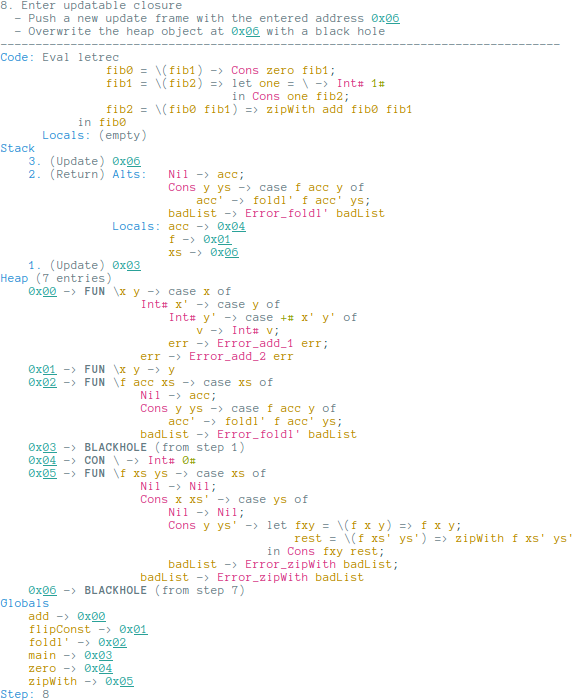

STG interpreter
===============

[](https://travis-ci.org/quchen/stg)



About the machine
-----------------

The spineless tagless graph reduction machine, STG for short, is an automaton
used to map non-strict functional languages onto stock hardware. It was
developed for, and is heavily used in, [the Haskell compiler GHC][ghc].

This project implements an interpreter for the STG as it is [described in the
1992 paper on the subject][stg1992], with the main focus on being nice to a
human user. Things that might be important for an actual compiler backend, such
as performance or static analysis, are not considered in general; only if it
helps the understanding of the STG.

The idea behind the machine is to represent the program in its abstract syntax
tree form. However, due to references to other parts of the syntax tree, a
program is a graph, not a tree. By evaluating this graph using a small set of
rules, it can be systematically reduced to a final value, which will be the
result of the program.

The STG is
  - **spineless** because the graph is not represented as a single data
    structure in memory, but as a set of small parts of the graph that reference
    each other. An important part of the evaluation mechanism is how to follow
    these references.
  - **tagless** because all heap values - unevaluated values, functions, already
    evaluated values - are represented alike on the heap, in form of closures.
    Tag*ful* would mean these closures have to be annotated with things type
    information, or whether they were previously evaluated already.
  - **graph reducing** because heap objects can be overwritten by simpler values
    the machine has found out to be equivalent. For example, the computation
    `1+1` on the heap might be overwritten by a constant `2` once that result
    has been obtained somewhere.


Useful applications
-------------------

These are some of the questions the STG answers:

1. Does this leak memory? If yes, then on the heap or on the stack, and why?
2. I heard GHC doesn't have a call stack. How does that work?
3. Why is this value not garbage collected?


Differences from the 1992 paper
-------------------------------

### Grammar

- Values are represented by function application to an empty argument list,
  `x ()`, as opposed to having no argument list at all in the paper.
- parentheses `()` instead of curly braces `{}`
- Comment syntax like in Haskell
- Constructors can end with a `#` to allow labelling primitive boxes
  e.g. with `Int#`.

### Evaluation

- The three stacks from the operational semantics given in the paper - argument,
  return, and update - are unified into a single one, since they run
  synchronously anyway. This makes the current location in the evaluation much
  clearer, since the stack is always popped from the top. For example, having a
  return frame at the top means the program is close to a `case` expression.
- There are different objects on the heap, not just closures:
    - Closures are classified in three groups for the user:
        - Constructors are closures with a constructor application body, and
          only free variables.
        - Other closures with only free variables are thunks.
        - Closures with non-empty argument lists are functions.
    - Black holes overwrite updatable closures upon entering, allowing for
      `<<loop>>` detection and avoiding certain space leaks (... apparently,
      at least the 1992 paper says so).


GHC's current STG
-----------------

Since 1992, the STG has undergone one notable revision, documented in [the 2004
paper *How to make a fast curry*][fastcurry], which treats function application
a bit different. I don't have plans to support this evaluation model right now,
but it's on my list of long-term goals (alongside the current push/enter).


Short language introduction
---------------------------

The STG language can be seen as a mostly simplified version of Haskell with a
couple of lower level additions. Most importantly, STG is a wholly untyped
language.


### Top-level

An STG program consists of a set of bindings, which each have the form

```haskell
name = (free vars) \π (bound vars) -> body
```

The right-hand side is called a *lambda form*, and is closely related to the
usual lambda from Haskell.

  - Bound variables are the lambda paramaters just like in Haskell.
  - The *update flag* `π` can be either `u` for *update* or `n` for *no
    update*. This flag is key for the graph reduction mechamism of the STG,
    and will be discussed later. It is safe to always use `n` as update flag.
  - Free variables are the variables used in the `body` that are not bound or
    global. This means that variables from the parent scope are not
    automatically in scope, but you can get them into scope by adding them to
    the free variables list.

### Expressions

The body of a lambda form is an expression. Expressions can, in general, be one
of a couple of alternatives.

  - **Let:** `let <...bindings...> in <expression>`: Introduce local definitions
    similar to Haskell's `let`, with one key difference: the `...bindings...`
    cannot refer to each other (or themselves). In other words, `let` is
    non-recursive.
  - **Letrec:** `letrec ...bindings... in expression`: The recursive version of
    `let`; behaves just like in Haskell.
  - **Case:** `case <expression> of <alts>`: evaluate the <expression> (called
    scrutinee) to WHNF and continue evaluating the matching alternative. Note
    that the WHNF part makes case strict, and indeed it is the *only* construct
    that does evaluation.
  - **Function application:** `function (<args>)`: Like Haskell's function
    application. The `<args>` are primitive values or variables.
  - **Primitive application:** `primop# <arg1> <arg2>`: Primitive operation on
    unboxed integers.
  - **Constructor application:** `Constructor (<args>)`: An algebraic data
    constructor applied to a number of arguments, just like function
    application.
  - **Primitive literal:** An integer postfixed with `#`, like `123#`.

For example, Haskell's `maybe` function could be implemented in STG like this:

```haskell
maybe = () \n (just, nothing, x) -> case x () of
    Just (j) -> just (j);
    Nothing () -> nothing
```

Note that values are written like functions with empty argument lists.

### Updates

The update flag of a lambda form tells the machine to update the lambda form's
value in memory once it has been calculated, so the computation does not have to
be repeated should the value be required again. This is the mechanism that is
key to the lazy evaluation model the STG implements. For example, evaluating
`main` in

```haskell
add = <add two boxed ints>
one = () \n () -> Int# (1#);
two = () \n () -> Int# (2#);
main = () \u () -> add2 (one, two)
```

would, once the computation returns, overwrite `main` (modulo technical
details) with

```haskell
main = () \u () -> Int# (3#)
```

A couple of things to keep in mind:

- Closures with non-empty argument lists and constructors are already in WHNF,
  so they are never updatable.
- When a value is only entered once, updating it is unnessecary work. Deciding
  whether a potentially updatable closure should actually be updatable is what
  the *update analysis* would do in a compiler when translating into the STG.


### Pitfalls

- Semicolons are an annoyance that allows the grammar to be *much* simpler, so
  we're trading code complexity for usability here - a worthy tradeoff for a
  project that aims to have relatively simple code as part of its goal.

- Lambda forms stand for deferred computations, and as such cannot have
  primitive type, which are always in normal form. To handle primitive types,
  you'll have to box them like in

  ```haskell
  three = () \n () -> Int# (3#)
  ```

  Writing

  ```haskell
  three' = () \n () -> 3#
  ```

  is invalid, and the machine would halt in an error state.

- Values and nullary constructors take empty argument lists - `()` - as
  arguments.

- Function application cannot be nested, since function arguments are primitives
  or variables. Haskell's `f (g x)` would be written
  `let gx = () \n () -> g (x) in f (gx)` in the STG, assuming all variables are
  in global scope.

- Free variable values have to be explicitly given to the closure. Function
  composition could be implemented like

  ```haskell
  compose = () \n (f,g,x) -> let gx = (g,x) \n () -> g (x)
                             in f (gx)
  ```

  Forgetting to hand `g` and `x` to the `gx` lambda form would mean that in the
  `g (x)` call neither of them was in scope, and the machine would halt with
  a "variable not in scope" error.


### Code examples

Instead of recreating lots of examples here, have a look at the modules in the
`Prelude`, which contain the STG versions of common Haskell functions. Combined
with the above explanations, this is all you should need to get started.


Running an STG program
----------------------

There is only one way to directly run an STG program, and that is by writing it
in `app/Main.hs`. Afterwards, run

```bash
stack build --exec "stg-exe --colour=true" | less -R
```

to get coloured output in `less`. Type `/====` to search for `====`, which
finds the top of every new step; use `n` (next step) or `N` (previous step) to
navigate through the execution.


[ghc]: https://www.haskell.org/ghc/
[stg1992]: http://research.microsoft.com/apps/pubs/default.aspx?id=67083
[fastcurry]: http://research.microsoft.com/en-us/um/people/simonpj/papers/eval-apply/
